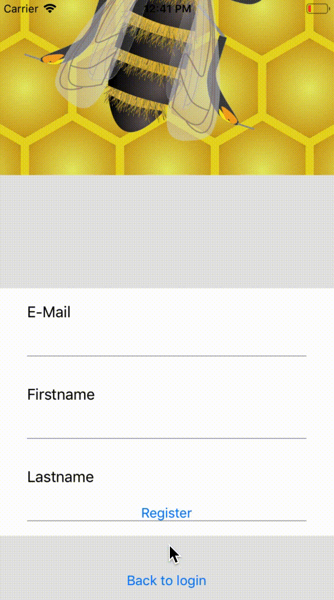

# SwiftDataProvider

[](https://travis-ci.org/EMart86/SwiftDataProvider)
[](https://cocoapods.org/pods/SwiftDataProvider)
[](https://cocoapods.org/pods/SwiftDataProvider)
[](https://cocoapods.org/pods/SwiftDataProvider)


{:height="50%" width="50%"}

## Example

Boilerplate code for TableViews and animated updates is history. Design your TableView with your Models instead of keeping track of all the IndexPaths and IndexSets, nice and easy.

To run the example project, clone the repo, and run `pod install` from the Example directory first.

## Requirements

iOS 8.0
XCode 10
Swift 4.1

## Installation

SwiftDataProvider is available through [CocoaPods](https://cocoapods.org). To install
it, simply add the following line to your Podfile:

```ruby
pod 'SwiftDataProvider'
```

## Author

Martin Eberl, eberl_ma@gmx.at

## License

SwiftDataProvider is available under the MIT license. See the LICENSE file for more info.

## Usage

### 1) Implement UITableViewController or UITableView with the  `RecyclerView` protocol

### 2) Hold a strong reference to the SwiftDataProvider
```swift
    private var swiftDataProvider: SwiftDataProvider?
```

### 3) Create a SwiftDataProvider instance eg in viewDidLoad and assign it as TableViewDataSource to the TableView
```swift
override func viewDidLoad() {
    super.viewDidLoad()
    
    //do assign to the tableviews delegate ALWAY BEFORE creating and assigning
    //the SwiftDataProvider to the UITableView or UITableViewController, otherwhise
    //the section header and footer view won't appear, when you handle them within the SwiftDataProvider
    self.tableViewDelegate = self 
    
    self.swiftDataProvider = SwiftDataProvider(recyclerView: self)

    //step 4
}
```

### 4) Register cells for reusing and mapping to the content it requires, eg below the initialization of the SwiftDataProvider. **Use unique names for your data models!**
```swift
    swiftDataProvider?.register(cell: UITableViewCell.self, for: String.self) { cell, content in
        cell.textLabel?.text = content
    }

    swiftDataProvider?.register(cell: UITableViewCell.self, for: /*Your data model*/.self) { cell, content in
        cell.textLabel?.text = content.formattedDate
    }

    swiftDataProvider?.register(cellReuseIdentifier: "TestCell", as: TestCell.self, for: TestCell.Content.self) { cell, content in
        cell.content = content
    }

//step 5
```

### 5) Assign a content adapter. The example uses the [MVVM](https://medium.com/flawless-app-stories/how-to-use-a-model-view-viewmodel-architecture-for-ios-46963c67be1b) pattern but you can also implement the ContentAdapter in the ViewController.
```swift
    swiftDataProvider?.contentAdapter = viewModel.contentAdapter
```

### 6) a) Use a ContentProviderAdapter for self-controlled content and add sections and rows or update the section header and footer:
```swift
// in the ViewModel

struct ViewModel {
    let contentAdapter = ContentProviderAdapter()
    let section = Section()
    ...

    init() {
        //Use a string or a model, the string uses the default header view, the
        //model requires you to provide a section header view
        section.header = "" 
        contentAdapter.add(section: section)
        
        //use automatically update if you'd like the table view 
        //to be updated every time, something is being inserted, deleted or triggered a reload.
        //Default is false, so you can do multiple updates at a time
        //contentAdapter.isAutoCommitEnabled = true
    }

    func addContent() {
        section.add(row: /*Your data model*/)
        // .. insert, remove models, cells ..
        
        //find a specific instance of a model in the section
        let content: <Model Type> = section.content {
            //return true or false
        }
        
        //if you didn't enable the autocommit, you'll have to trigger the update manually
        contentAdapter.commit()
    }
    
    func uödate
}
```

### 6) b) or use a DynamicContentProviderAdapter for automatic-controlled content:
```swift
// in the ViewModel

struct ViewModel {
    let contentAdapter = DynamicContentProviderAdapter</*Your data model*/>()

    ...

    init() {
        contentAdapter.sort = { $0 < $1 }
        contentAdapter.sectionContentUpdate = { section in
            //Update sectin content whenever a new row has been added
            //use string to show the default section header view or a model, to use a custom view
            section.header = "\(section.rows.count) Items" 
            
            //action to be used after a section update has performed (.none or .reload)
            return .reload 
        }
        
        //use automatically update if you'd like the table view 
        //to be updated every time, something is being inserted, deleted or triggered a reload.
        //Default is false, so you can do multiple updates at a time
        //contentAdapter.isAutoCommitEnabled = true
        
        contentAdapter.sectionInitializer = { section in
            //Initialize sectin content the first time, a new Section has been created
            //use string to show the default section header view or a model, to use a custom view
            section.header = "\(section.rows.count) Items" 
        }
        
        contentAdapter.contentSectionizer = { content, sections in
            //Sectionize the content
            //return .new or .use(index of the section) to create a new section or use the given section
            guard let last = sections?.last else {
                return .new
            }
            
            //Here i'm filtering the row
            //if the model to be added into a section is "older" than a minute, a new section will be created, otherwhise use the latest section
            let rows = last.rows.compactMap { $0 as? TimeModel }
            if let timeInterval = rows.first?.date.timeIntervalSince(content.date), timeInterval < -60 {
                return .new
            }
            return .use((sections?.count ?? 1) - 1)
        }
    }

    func addContent() {
        contentAdapter.add(/*Your data model*/)
        
        //if you didn't enable the autocommit, you'll have to trigger the update manually
        contentAdapter.commit()
    }
}
```

### What is the difference between the ContentProviderAdapter and the DynamicContentProviderAdapter?

The ContentProviderAdapter is a class in which you can controll the sections and the rows within the sections. This is mainly used when you know, how the content structure should look like. So you add several sections and rows to the sections.

The DynamicContentProviderAdapter is a class in which you only provide content and based on a provided logic, the content is ordered into the section. However since the DynamicContentProviderAdapter is derived from ContentProviderAdapter, you can also provide custom sections.
